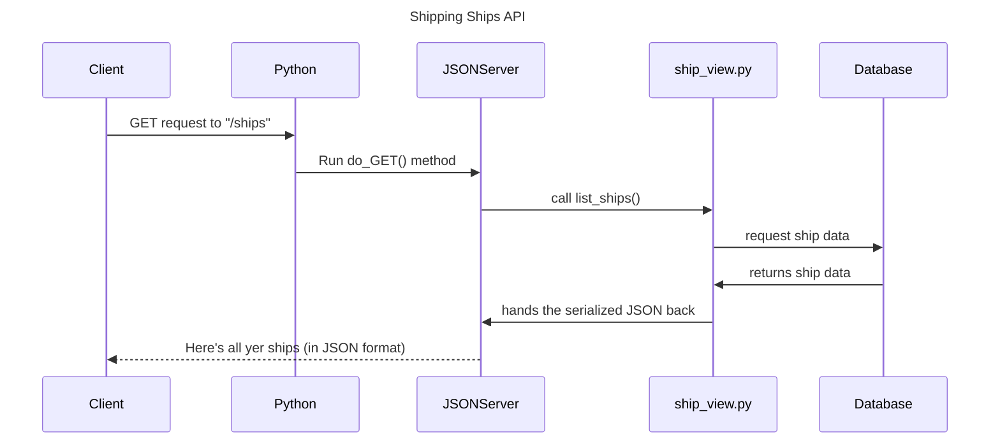

```mermaid
sequenceDiagram
    title Shipping Ships API

    participant Client
    participant Python
    participant JSONServer
    participant ship_view.py
    participant Database
    Client->>Python:GET request to "/ships"
    Python->>JSONServer:Run do_GET() method
    JSONServer->>ship_view.py: call list_ships()
    ship_view.py->>Database: request ship data
    Database->>ship_view.py: returns ship data
    ship_view.py->>JSONServer: hands the serialized JSON back
    JSONServer-->>Client: Here's all yer ships (in JSON format)
```